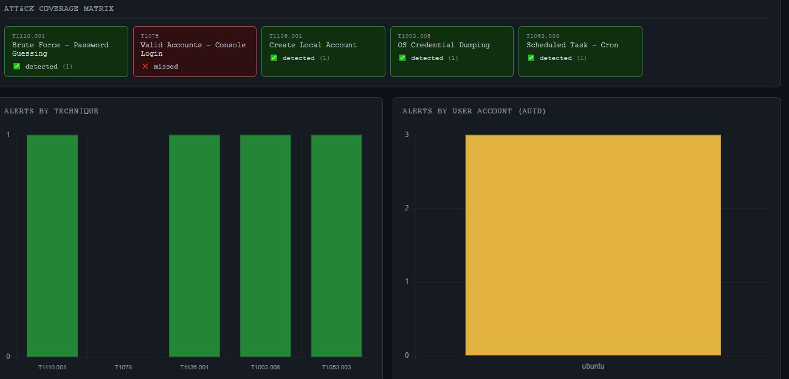
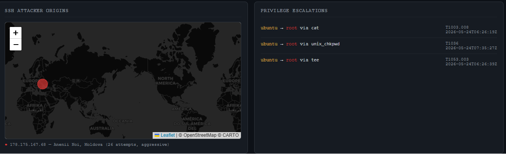
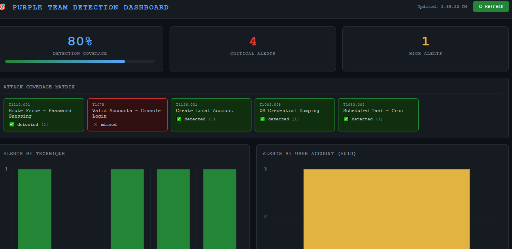
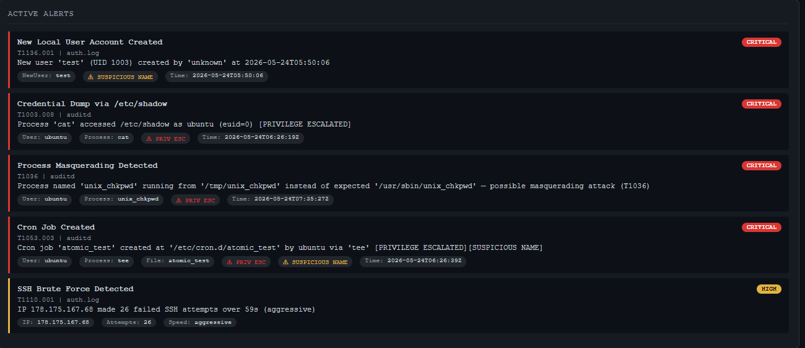

# Purple Team Detection Pipeline

An automated threat detection system that simulates real MITRE ATT&CK techniques on AWS infrastructure and measures detection coverage in real time.

Built as a demonstration of detection engineering principles — not a tutorial project, but a working system that has detected real, unsimulated attacks on a live server.

## What It Does

- Simulates attacks using Atomic Red Team, mapped to MITRE ATT&CK techniques, on an AWS EC2 instance
- Collects logs incrementally from three sources — Linux auditd, `auth.log`, and AWS CloudTrail — using seek pointers to process only new lines each run
- Normalizes events through a Pydantic schema layer — typed, validated Python objects before any rule ever sees the data
- Detects attacks using **14 custom Python detection rules** with false-positive filtering tuned against real production logs
- Generates coverage reports showing which techniques were detected, which were missed, and why
- Visualizes results on a real-time dashboard with an ATT&CK matrix, attacker geolocation map, and user activity charts
- Documents detection logic with Sigma rules (portable to any SIEM) and analyst playbooks per technique
- **Runs a CI/CD pipeline** (GitHub Actions) that executes the full test suite on every push and pull request, against a clean environment — not just "it works on my machine"

## Architecture


*(Six layers: Log Sources → Log Collector → Schema Layer → Detection Rules → Engine → API + Dashboard. See the "Schema Layer" section below for detail on the middle layers.)*

## ATT&CK Techniques Covered

| # | Technique | Name | Log Source | Detection Method |
|---|-----------|------|------------|-------------------|
| 001 | T1110.001 | Brute Force: Password Guessing | auth.log | Sliding window (60s), attack speed classification |
| 002 | T1078 | Valid Accounts: No MFA | CloudTrail | `sessionContext.mfaAuthenticated` on ConsoleLogin + broader API-call check |
| 003 | T1136.001 | Create Local Account | auth.log | `useradd` pattern, suspicious-username set |
| 004 | T1003.008 | OS Credential Dumping | auditd | `shadow_access` key + exe whitelist + admin-non-privileged guard |
| 005 | T1548 | Privilege Escalation | auditd | `euid=0` + `auid≠0` + `auid≠4294967295`, gated on privesc-specific keys |
| 006 | T1078.001 | Valid Accounts: Root Login | CloudTrail | `userIdentity.type == "Root"` + successful ConsoleLogin |
| 007 | T1110.001 | Brute Force Success | auth.log | ≥5 failures from an IP followed by an accepted login ≤600s later |
| 008 | T1053.003 | Cron Persistence | auditd | `cron_modification` key + path-modifying syscalls only (openat/open/rename/link) |
| 009 | T1562.002 | CloudTrail Disabled | CloudTrail | `DeleteTrail`/`StopLogging` (CRITICAL), `UpdateTrail`/`PutEventSelectors` (HIGH) |
| 010 | T1562.001 | auditd/Logging Tamper | auditd | 4 tamper keys (auditd, rules, syslog, bootloader), severity scales with privilege |
| 011 | T1548 | Sudoers Tamper | auditd | `sudoers_tamper` key on any `/etc/sudoers` or `/etc/sudoers.d/` touch |
| 012 | T1087.001 | Account Enumeration | auditd | Enumeration commands / sensitive-file reads, 5+ in 120s sliding window per auid |
| 013 | T1082 | System Discovery | auditd | 5+ recon commands (uname, netstat, ss, etc.) in 120s sliding window per auid |
| 014 | T1036 | Masquerading | auditd | exe/comm mismatch (truncation-aware) **and** sensitive-name-in-untrusted-path, checked across *all* auditd events |

**Detection coverage: 14 techniques across 8 ATT&CK tactics.**

*(Note: this table reflects the actual current mapping of rule number → technique, verified directly against each rule's source file. An earlier version of this table had drifted out of sync with the code as rules were split and renumbered during development — a lesson in its own right, see "What I Learned" below.)*

## Schema Layer

All log sources are normalized through a Pydantic validation layer before reaching detection rules. Raw log bytes become typed Python objects at the boundary — no rule ever parses strings or handles missing keys.

```
/var/log/auth.log     →  AuthLogEvent    (source_ip, auth_result, username, port)
/var/log/audit.log    →  AuditdEvent     (auid, uid, euid, exe, comm, key, name)
S3 CloudTrail JSON    →  CloudTrailEvent (actor_username, mfa_authenticated, event_name)
```

Key design decisions:

- **`frozen=True`** — events are immutable after parsing; rules cannot corrupt shared state
- **UTC normalization** — all timestamps converted to UTC-aware `datetime` before any rule runs, via a two-layer validator chain (a subclass validator handles source-specific formats — e.g. syslog's yearless timestamps — then hands off to a base validator that guarantees the final UTC-normalized type)
- **auditd multi-record correlation** — `SYSCALL` + `PATH` records grouped by serial number before parsing, so filenames from `PATH` records aren't lost
- **`extra: allow`** — unknown fields preserved for forensics without crashing the pipeline (this also means test-authoring needs care — passing an unrecognized kwarg to a fixture silently succeeds rather than erroring; see Testing section)
- **`model_validator(mode="after")` for `CloudTrailEvent`** — actor identity fields (`actor_type`, `mfa_authenticated`) are *always* derived from the raw nested `userIdentity` block, even if you try to set them directly on construction — a real gotcha discovered while building the test suite (see below)

## Testing & CI/CD

Every one of the 14 detection rules has a dedicated pytest test file (`tests/test_rule_*.py`), covering the happy path, negative/guard conditions, and — for rules with thresholds or sliding windows — genuine boundary cases (not just "obviously inside" or "obviously outside" the window, but the actual numeric edge).

A GitHub Actions workflow (`.github/workflows/ci.yml`) runs the full suite on every push and pull request, against a clean `ubuntu-latest` runner — not the developer's own machine, which matters more than it sounds:

**Real bugs this testing effort found and fixed, not hypothetical:**

- **`schemas/auth_log.py` timestamp validator raised `NameError` on any non-string input** — an indentation bug (`if m:` sat outside the `isinstance(v, str)` guard) that only manifests when a `datetime` object is passed directly rather than through `from_raw()`'s string-parsing path. Found by the rule_001 test suite itself, on live production code, not written in as a known bug beforehand.
- **`requirements.txt` was missing `pydantic` and `pyparsing`** — both genuinely imported by the schema layer, silently working locally because they happened to already be installed in the dev environment; would fail immediately on any clean install.
- **`rule_004`'s `ADMIN_AUIDS` exclusion guard was accidentally deleted** during an unrelated refactor (splitting masquerading logic into its own `rule_014`) — a real regression that would have caused false CRITICAL alerts on ordinary admin activity. Caught and restored specifically because a regression test for that exact guard existed.
- **`rule_011` (sudoers tamper) was completely non-functional in production** — see "Known Limitations" below for the full investigation; this is the single most significant finding of the whole testing effort.
- **A `sys.path` portability bug** in `tests/conftest.py` — tests passed locally (invoked via `python3 -m pytest`, which adds the cwd to `sys.path` automatically) but failed in CI (invoked via plain `pytest`, which doesn't) with `ModuleNotFoundError: No module named 'schemas'`. Fixed by computing the project root relative to `conftest.py`'s own file path rather than relying on invocation-method-dependent behavior.

**A note on test data traps**, since more than one showed up during development: Pydantic's `extra: allow` config means passing a nonexistent or read-only-property-named keyword argument to a test fixture (e.g. `is_privileged_escalation=True`, or `epoch=5` where `epoch` is a computed `@property`) does **not** raise an error — it's silently absorbed as inert extra data, and the real computed value is used instead. Several early test drafts had this exact issue, discovered only by manually verifying computed values (`event.epoch`) actually reflected the intended override rather than assuming they did.

## Sigma Rules

13 of the 14 detection rules have a corresponding Sigma rule in `/sigma/` — portable to Splunk, Elastic, and Microsoft Sentinel via `sigma-cli`. (`rule_014`'s Sigma rule is not yet written — open item.)

```bash
# Convert to Splunk SPL
sigma convert -t splunk sigma/rule_001_ssh_brute_force.yml

# Convert to Elasticsearch
sigma convert -t elasticsearch sigma/rule_004_shadow_access.yml
```

Note: Sigma rules match single events. Threshold/window correlation (e.g. 5 failures in 60s) is handled by the Python detection rules, not expressible in single-event Sigma syntax.

Every Sigma file was validated for structural correctness (valid YAML, required fields present, unique and well-formed UUIDs, valid `level` values) — several files originally contained literal markdown code-fence artifacts (` ```yaml `) left over from a bulk copy-paste, which made them invalid YAML until caught and fixed.

## Analyst Playbooks

Each detection rule has a corresponding playbook in `/playbook/` documenting: immediate actions (0–15 min), investigation questions, containment steps, evidence to collect, and how to prevent recurrence.

## Incremental Log Processing

The pipeline uses seek pointers to avoid reprocessing old log lines:

```json
// reports/state.json — updated after every run
{
  "auth_log_position": 48392,
  "auditd_position": 129841,
  "cloudtrail_last_file": "349491201539_CloudTrail_eu-north-1_20260604T1310Z.json.gz",
  "last_run": "2026-06-04T10:30:00Z"
}
```

- `auth.log` / `auditd`: byte-position seek — reads only lines written since last run
- CloudTrail: last-filename tracking — alphabetical order equals chronological order
- Log rotation detection: resets position if file size < last known position

## Alert Persistence and Deduplication

Alerts accumulate across runs in `reports/alerts.json`. New alerts are deduplicated before appending:

```python
dedup_key = f"{rule_id}:{source_ip}:{username}:{extra.get('auid', '')}"
```

Same attacker triggering the same rule suppresses duplicate pages to analysts.

## Real Findings During Development

This system detected real attacks — not just simulated ones:

- **178.175.167.68 (Moldova)** — 26 SSH brute force attempts over 59 seconds
- **47.251.122.241** — 55 failed SSH attempts detected automatically, no simulation involved
- **139.19.117.129** — repeated login attempts across multiple days, a persistent scanner

These appeared naturally on the internet-facing EC2 instance within 24 hours of deployment.

## Known Limitations

Grouped by type — this is intentional. Detection engineering isn't about hiding gaps; documenting them precisely is part of the job.

### Production bugs found and fixed (via test-driven investigation, not code review alone)

- **`rule_011` (sudoers tamper) was completely non-functional until discovered through testing.** Two independent, stacked failures: (1) no auditd watch rule existed for `/etc/sudoers` at all — confirmed via `auditctl -l` — meaning the rule could never receive a single matching event regardless of code correctness; (2) even after adding the missing watch rule (`-w /etc/sudoers -p wa -k sudoers_tamper`), the original design attempted to substring-match "dangerous" sudoers directives (`NOPASSWD`, `!authenticate`, etc.) against `event.raw` — but auditd captures syscall-level metadata only (process, path, syscall number), never the actual file content written, confirmed via real `ausearch` output against live test edits to both `/etc/shadow` and `/etc/sudoers`. The dangerous-flag substring logic was removed entirely; the rule now correctly alerts CRITICAL on any sudoers modification without pretending to distinguish severity by content it structurally cannot see. **This is the strongest argument in this project for treating detection rules as needing periodic live-data verification, not just unit tests against mocked events** — unit tests alone would never have caught either failure, since both are about the gap between what the code assumes reality provides and what auditd actually delivers.
- `rule_004`'s admin-exclusion guard (`ADMIN_AUIDS`) was accidentally dropped during a refactor and restored after a regression test caught it.
- `schemas/auth_log.py`'s timestamp validator crashed on non-string input due to an indentation bug; fixed and covered by a regression test.

### Known design limitations (confirmed, not yet addressed)

- **`AttackSpeed.AGGRESSIVE` classification is currently mathematically unreachable.** `rule_001`'s sliding window fires the instant `THRESHOLD` (5) attempts are seen, then resets — so `attempt_count` is always exactly 5 at first fire, capping the maximum possible rate at `5 / max(duration, 1) = 5`, which can never exceed the AGGRESSIVE threshold of `rate > 10`. Pinned down by a dedicated test documenting the finding rather than left as silent dead code.
- **CloudTrail test fixtures are based on a real captured sample, not a live schema contract.** If AWS changes CloudTrail's event schema, these tests would continue passing against a stale assumption rather than catching drift. Mitigation: periodically diff a freshly captured real record against the fixture structure; not currently automated.
- Sudo token hijacking (T1548.003) requires cross-source correlation between `auditd` `euid=0` events and `auth.log` PAM records — not yet implemented.
- EXECVE record parsing (full command-line arguments) not yet implemented.
- Living-off-the-land techniques using only whitelisted binaries are not detected.
- Lateral movement to other AWS accounts / VPC Flow Log analysis not yet implemented.
- `auditd` killed via `SIGKILL` cannot log its own death; heartbeat monitoring partially mitigates but isn't yet built.

### Investigated and confirmed non-issues

- The `sudo_execution` auditd watch rule points at `/usr/lib/cargo/bin/sudo` rather than the more familiar `/usr/bin/sudo` path. Initially suspicious (non-standard location for a security-critical binary) — confirmed via `readlink -f` and `dpkg -S` that this is the real, legitimately-packaged `sudo-rs` (a Rust reimplementation of sudo used by this distribution), correctly watched via its real, symlink-resolved inode. Documenting this here so it isn't re-investigated as a false alarm later.

## Technical Stack

- **Detection Engine:** Python 3.11, Pydantic v2
- **Log Sources:** Linux auditd, `/var/log/auth.log`, AWS CloudTrail (S3)
- **Schema Layer:** Pydantic models — `AuditdEvent`, `AuthLogEvent`, `CloudTrailEvent`, `Alert`
- **Testing:** pytest, 14 rule test files, GitHub Actions CI on every push/PR
- **Sigma Rules:** 13 rules (14th pending), portable via `sigma-cli` to Splunk/Elastic/Sentinel
- **Attack Simulation:** Atomic Red Team (MITRE ATT&CK mapped)
- **Cloud:** AWS EC2, S3, CloudTrail, SNS, IAM, Systems Manager (SSM Session Manager for port-22-free remote access)
- **API:** FastAPI with typed `response_model` schemas
- **Dashboard:** HTML/CSS/JavaScript, Leaflet.js, Chart.js
- **Container:** Docker
- **Infrastructure:** AWS VPC, Security Groups, IAM

## How to Run

### Prerequisites
- AWS account with EC2, CloudTrail, S3 configured
- Ubuntu EC2 instance with auditd installed
- Python 3.11+
- Docker (optional)

### Setup

```bash
git clone https://github.com/Yuvraj-pandey-yuvi/purple-team-detection
cd purple-team-detection

pip install -r requirements.txt      # production
pip install -r requirements-dev.txt  # + pytest, PyYAML for local test running

aws configure

# Run detection engine
python3 detection/engine.py

# Start API server
python3 -m uvicorn dashboard.api:app --host 0.0.0.0 --port 8000

# Run the full test suite locally
pytest tests/ -v
```

### Docker

```bash
docker build -t purpleteam .
docker run -p 8000:8000 purpleteam
```

## Dashboard

| ATT&CK Coverage Matrix | Attacker Geolocation Map |
|---|---|
|  |  |

| User Activity Charts | Alert Timeline |
|---|---|
|  |  |

## What I Learned

- **False positives are the real problem.** `unix_chkpwd` accesses `/etc/shadow` on every SSH login. Getting from 68 noisy alerts to 5 clean ones required understanding legitimate system behavior — which you only learn by reading actual logs.
- **Schema design matters before rule design.** Building a Pydantic validation layer first meant every rule received typed, validated objects — no string parsing, no key-existence guards scattered through detection logic.
- **auditd multi-record correlation is non-obvious.** A single syscall generates `SYSCALL` + `PATH` + `EXECVE` records sharing a serial number. Treating each line independently loses the filename from `PATH` records.
- **Auditd captures metadata, not content — and this has real consequences for rule design.** The `rule_011` investigation (above) is the clearest proof: any detection rule assuming raw file *content* is available in an auditd event will silently never fire, no matter how correct its matching logic looks on paper.
- **A rule can be perfectly correct in code and still be completely dead in production**, if the underlying data source (an auditd watch rule, in `rule_011`'s case) was never actually wired up. Code review and even passing unit tests against mocked data can't catch this — only checking against real, live system state can.
- **Documentation drifts out of sync with code by default, not by exception.** This README's own ATT&CK coverage table had silently drifted — technique numbers no longer matched the actual rule files — after rules were split and renumbered during development. Caught only by deliberately re-verifying every mapping against source files rather than trusting the existing table.
- **Real attackers appear faster than expected.** Within 24 hours of exposing an EC2 instance, real bots were scanning it — turning a simulated detection project into one with genuine real-world validation.

## Author

Yuvraj Pandey
B.Tech Computer Science, JNU (2024–2028)
